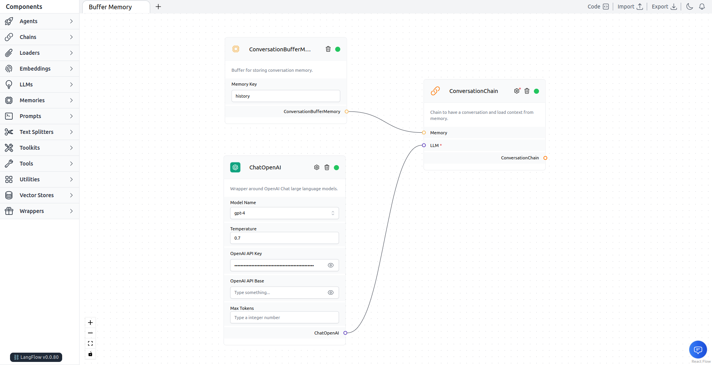

# Buffer Memory

The `Conversation Buffer Memory` stores messages and extracts them into variables.

Learn more about the Buffer Memory [here](https://python.langchain.com/en/latest/modules/memory/types/buffer.html).

### ⛓️LangFlow example

In this LangFlow example we used [`ChatOpenAI`](https://platform.openai.com/) as the LLM, a `Conversation Chain` as a chain. When you open the chat and start a conversation, it will take the message as input and return a response. LLM generates the response, and the conversation message will be store in the Buffer Memory.