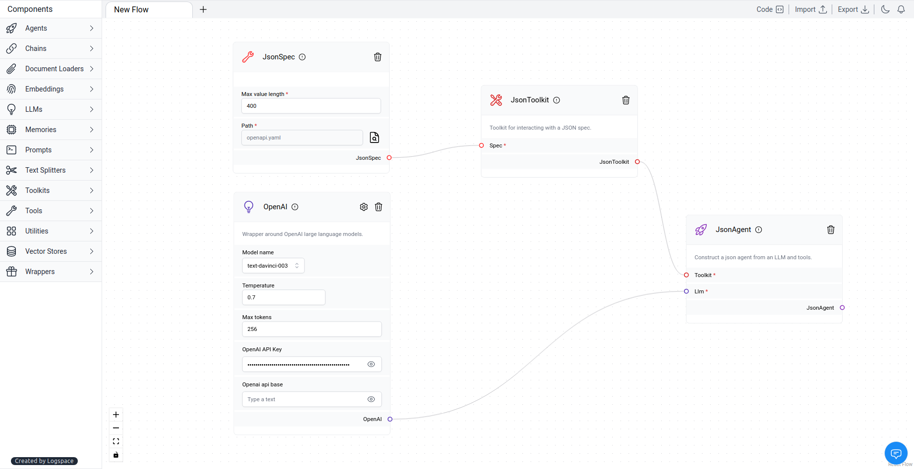

# JSON Agent

The `JSON Agent` is an agent designed to interact with large JSON/dict objects.

Learn more about the JSON Agent [here](https://python.langchain.com/en/latest/modules/agents/toolkits/examples/json.html).

### ⛓️LangFlow example



 #### <a target="\_blank" href="json_files/JSON_Agent.json" download>Download Flow</a>

`JsonSpec` will define the max value length of the input and output of the agent. For the path file you can get [here](https://raw.githubusercontent.com/openai/openai-openapi/master/openapi.yaml).

*Max value length*:

```txt
4000
```

`JsonToolKit` for interacting with the JSON spec. 

For this example, we used [`OpenAI`](https://platform.openai.com/) as the LLM.