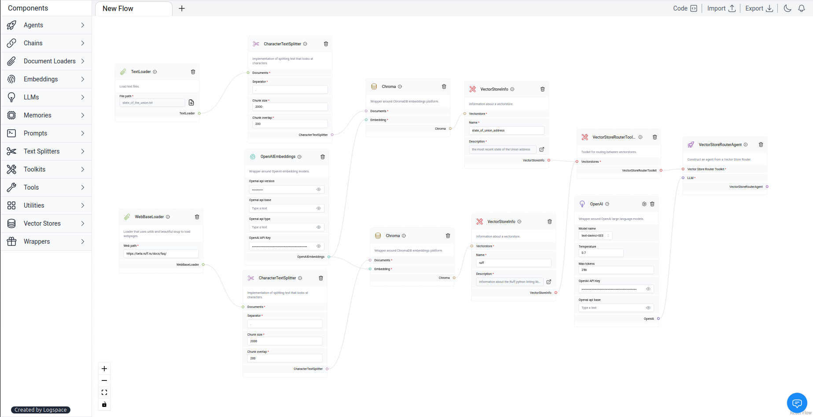

# Multiple Vectorstores

A vector store is a specialized database designed for the efficient storage of documents and their embeddings. It enables the retrieval of the most relevant documents for a given query by comparing the similarity of their embeddings to the query's embedding.

We can utilize the vector store to initialize an agent with multiple vector stores and leverage the agent for routing between them effortlessly.

Learn more about Multiple Vectorstores [here](https://python.langchain.com/en/latest/modules/agents/toolkits/examples/vectorstore.html?highlight=Multiple%20Vector%20Stores#multiple-vectorstores).

### ⛓️LangFlow example



`TextLoader` loads text from a file. Get the file used [here](https://github.com/hwchase17/chat-your-data/blob/master/state_of_the_union.txt)

By using `WebBaseLoader`, you can load all text from webpages into a document format that we can use downstream. Web path used:

```txt
https://pt.wikipedia.org/wiki/Harry_Potter
```

`CharacterTextSplitter` implements splitting text based on characters.

Text splitters operate as follows:

- Split the text into small, meaningful chunks (usually sentences).

- Combine these small chunks into larger ones until they reach a certain size (measured by a function).

- Once a chunk reaches the desired size, make it its piece of text and create a new chunk with some overlap to maintain context.

*Separator*:

```txt
.
```

*Chunk size*:

```txt
4000
```

*Chunk overlap*:

```txt
200
```

The `OpenAIEmbeddings`, wrapper around [OpenAI Embeddings](https://platform.openai.com/docs/guides/embeddings/what-are-embeddings) models. Make sure to get the API key from the LLM provider, in this case [OpenAI](https://platform.openai.com/).

`Chroma` vector databases can be used as vector stores to conduct a semantic search or to select examples, thanks to a wrapper around them.

A `VectorStoreInfo` set information about the vector store, such as the name and description.

**First VectorStoreInfo**

*Name*:

```txt
State of the union.
```

*Description*:

```txt
State of the union text.
```

**Second VectorStoreInfo**

*Name*:

```txt
Harry Potter Wikipedia.
```

*Description*:

```txt
Wikipedia about Harry Potter.
```

`VectorStoreRouterAgent` construct an agent that routes between multiple vectorstores.